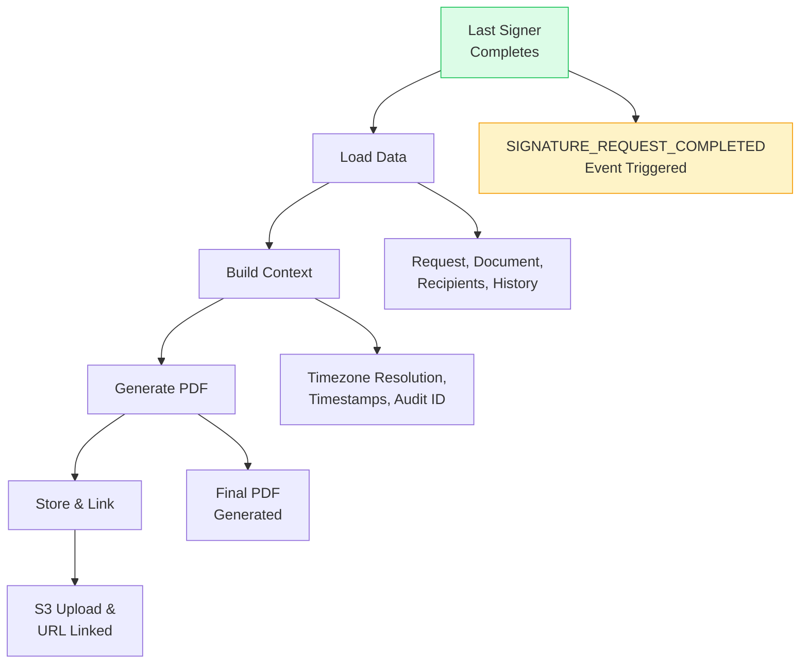
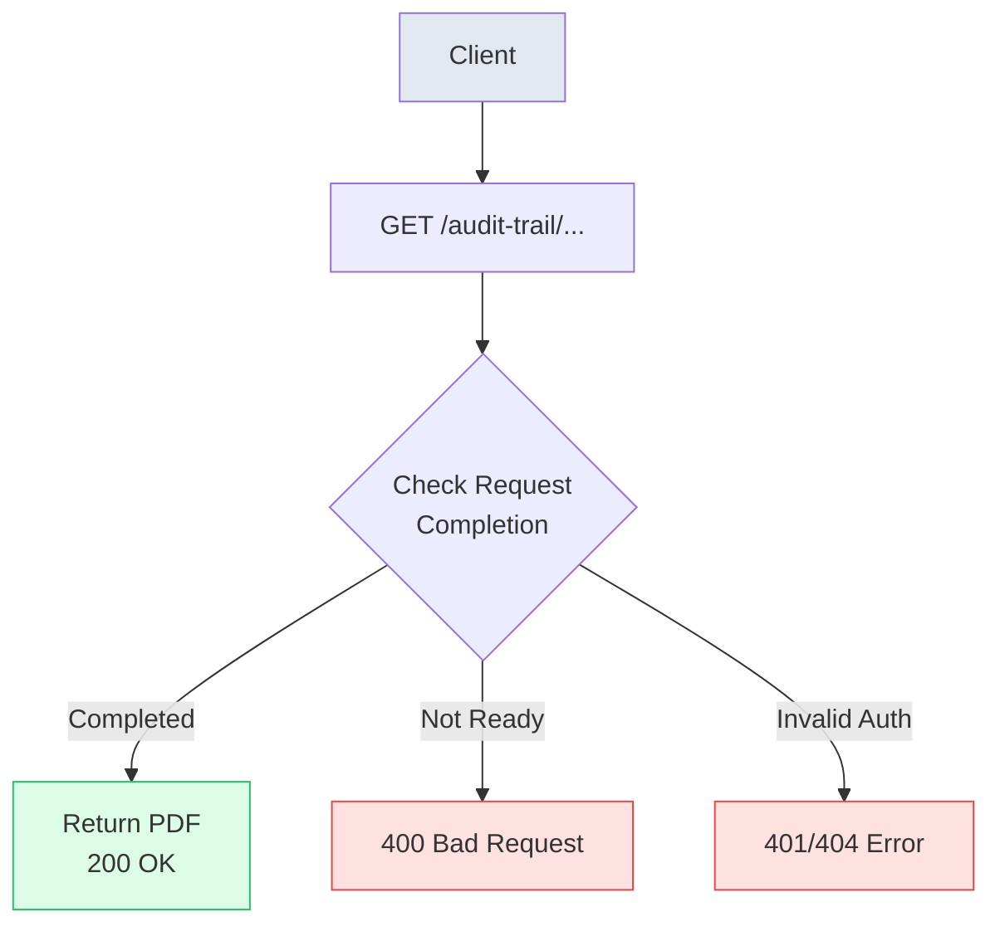

# Audit Trail System

An audit trail is like a detailed receipt or log of everything that happened during the signing process. It records who signed when, from where, and how they were verified. This proves the document is legitimate and helps with legal compliance, like a permanent record of the transaction.

A complete, tamper-resistant record generated for every completed signature request. Includes timestamps, IP addresses, signer identity, authentication methods, and an ordered event history. Audit trails are automatically produced the moment a request reaches **COMPLETED**.

## Overview

- **Automatic Generation**: Created instantly when the last signer finishes. Outputs PDF (final).
- **Comprehensive Data**: Request details, signers, timestamps, IP addresses, authentication methods, and full event history.
- **Timezone Support**: Automatic timezone resolution from IP addresses for legally accurate, local timestamps.
- **Secure Storage**: Stored as PDFs in S3 with configurable retention (default 7 years).

### Features
- Event History &mdash; chronological log of all actions
- Template-Based &mdash; professional Word template
- Output &mdash; PDF
- S3 Delivery &mdash; signed documents include audit URL

## Captured Data

### Document Sections

| Section | Content |
| :--- | :--- |
| **Audit ID** | Unique identifier for the audit trail |
| **Document Information** | Document ID, name, title |
| **Requester Information** | Name, email, phone, user ID, IP address |
| **Request Details** | Timestamps, expiration, signing order, security level |
| **Signature History** | Per-signer details with timestamps and IP addresses |
| **Completion** | Final completion timestamp |

### Request-Level Data

| Field | Description | Example |
| :--- | :--- | :--- |
| `Audit ID` | Format: `AUD-{shortId}-{timestamp}` | `AUD-a1b2c3d4-20251030-143022` |
| `Document ID / Name` | Document UUID and title | `UUID` / "Employment Contract" |
| `Request ID` | Signature request UUID | `UUID` |
| `Requester` | Name, email, phone, user ID | Jane Smith / jane@company.com |
| `IP Address` | Origination IP | 192.168.1.1 |
| `Security Level` | Signature type & auth methods | Simple Electronic Signature / Email OTP |
| `Signing Order` | Sequential or parallel | Sequential |
| `Timestamps` | Sent, expiration, completion | 2025-10-30T14:30:22-05:00 |

### Per-Signer Data

| Field | Description | Example |
| :--- | :--- | :--- |
| `Ordinal` | Signing order position | 1st |
| `Name / Email / Phone` | Recipient identity | John Doe / john@example.com |
| `IP Address` | Signing session IP | 192.168.1.5 |
| `Signature Type` | Method used | Simple Electronic Signature |
| `Signature Timestamp` | When signed (ISO 8601) | 2025-10-30T15:20:30-05:00 |

## Generation Workflow

1. **Trigger:** Last signer completes; event `SIGNATURE_REQUEST_COMPLETED` fires.
2. **Load Data:** Request, document, recipients (with fields), and history events.
3. **Build Context:** Resolve timezone from IPs, format timestamps, compute audit ID.
4. **Generate PDF:** Produce final PDF.
5. **Store & Link:** Upload to S3 `audit-trails/{requestId}/audit-trail.pdf` and persist URL on the signed document.



```java
// From DocumentSigningServiceImpl.java - generateAndStoreAuditTrail method
private String generateAndStoreAuditTrail(SignatureRequest signatureRequest, TempFileManager tempFileManager) {
    try {
        AuditTrailDocument auditTrailDocument = auditTrailService.generateAuditTrailDocument(signatureRequest.getId());
        byte[] pdfBytes = auditTrailDocument.pdfBytes();
        if (pdfBytes == null || pdfBytes.length == 0) {
            log.warn("Audit trail PDF bytes are null or empty for request: {}", signatureRequest.getId());
            return null;
        }

        if (s3Service.isS3Enabled()) {
            String auditKey = "audit-trails/" + signatureRequest.getId() + "/audit-trail.pdf";
            try (ByteArrayInputStream stream = new ByteArrayInputStream(pdfBytes)) {
                return s3Service.uploadFile(stream, auditKey, "application/pdf", pdfBytes.length);
            }
        } else {
            Path auditPath = tempFileManager.createTempFile("audit-trail", ".pdf");
            Files.write(auditPath, pdfBytes);
            return auditPath.toString();
        }
    } catch (Exception ex) {
        log.warn("Failed to generate or upload audit trail for request {}: {}. Document processing will continue without audit trail.", 
                signatureRequest.getId(), ex.getMessage());
        return null;
    }
}
```

## API & Retrieval

### `GET` `/api/v1/documents/audit-trail/{requestId}/download`

Downloads the generated PDF for a completed request. Auth: Bearer token.

**Response Headers**
```http
Content-Type: application/pdf
Content-Disposition: attachment; filename="audit-trail.pdf"
```

**Response Codes**
- `200` Success (PDF)
- `400` Request not completed
- `401` Unauthorized
- `404` Request not found

### Stored PDF Retrieval
Completed requests keep a stored audit URL for fast access.

```java
// From SignedDocumentServiceImpl.streamAuditTrailByRequestId
SignatureRequest signatureRequest = new SignatureRequest();
signatureRequest.setId(signatureRequestId);
var results = signedDocumentRepository.findBySignatureRequestOrderBySignedAtDesc(signatureRequest);

if (results == null || results.isEmpty()) {
    // Generate on-the-fly if not found
    var doc = auditTrailService.generateAuditTrailDocument(signatureRequestId);
    byte[] pdf = doc.pdfBytes();
    if (pdf == null || pdf.length == 0) {
        throw new ResourceNotFoundException("Audit trail not available for this request");
    }
    return new ByteArrayInputStream(pdf);
}

SignedDocument latest = results.getFirst();
String auditUrl = latest.getAuditTrailUrl();
if (auditUrl != null && !auditUrl.isBlank()) {
    if ((auditUrl.startsWith("http://") || auditUrl.startsWith("https://")) && auditUrl.contains("s3")) {
        String s3Key = extractS3KeyFromUrl(auditUrl);
        return s3Service.downloadFileAsStream(s3Key);
    }
}
```

### API Retrieval Flow



## Legal Compliance

Meets requirements for ESIGN, UETA, and eIDAS (Simple Electronic Signatures).

| Requirement | Implementation |
| :--- | :--- |
| **Intent** | Explicit click-to-sign recorded |
| **Identity** | Email OTP & IP tracking |
| **Integrity** | Tamper-resistant PDF output |
| **Retention** | 7-year storage policy |

### Data Included for Compliance
- Signer identity: name, email, phone
- Authentication method: Email OTP verification
- Timestamps: ISO 8601 with timezone
- IP addresses: per signing session
- Document identity: UUID and title
- Signing order: sequential or parallel
- Event history: complete action log
- Completion proof: final completion timestamp

## Event History Tracking

Audit trails embed the signature request history so you can see every state change.

| Event | When Recorded | Actor | Target |
| :--- | :--- | :--- | :--- |
| `CREATED` | Request created | Creator | — |
| `SENT` | Request sent | Creator | First recipient(s) |
| `VIEWED` | Recipient opened link | Recipient | — |
| `SIGNED` | Recipient signed | Recipient | — |
| `DECLINED` | Recipient declined | Recipient | — |
| `REMINDER_SENT` | Manual reminder | Creator | Recipient |
| `CANCELLED` | Request canceled | Creator | All recipients |
| `EXPIRED` | Deadline passed | System | Pending recipients |
| `COMPLETED` | All signatures collected | System | — |

## Timezone Resolution

Timestamps are localized using the signer/request IP. Falls back to UTC if no IP is available.

```java
// Format: ISO 8601 with offset (e.g. 2025-10-30T14:30:22-05:00)
value.atOffset(ZoneOffset.UTC)
     .toInstant()
     .atZone(targetZone) // Resolved from IP
     .format(ISO_OFFSET_FORMATTER);
```
