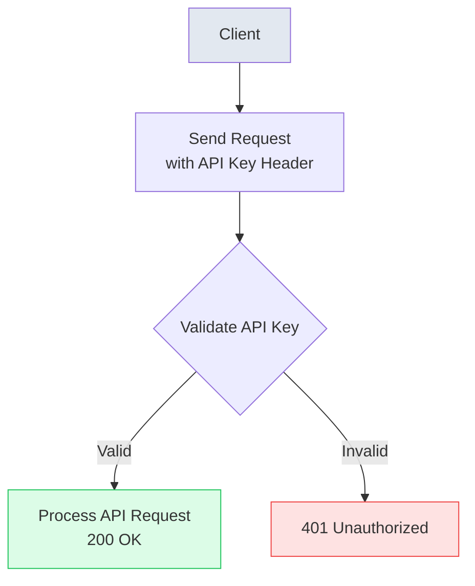

import Tabs from '@theme/Tabs';
import TabItem from '@theme/TabItem';

# Authentication

Authentication is like checking ID before entering a club. For CovoSign's API, you need to prove who you are by including your API key in the request headers. Headers are like notes attached to your message telling the server 'Hey, I'm allowed to ask this'. We'll show you how to add it in different programming languages.

All Enterprise API endpoints require secure authentication. Use API keys for programmatic access; multi-factor sign-in is recommended for console access.

Authentication in APIs is crucial for security, ensuring that only authorized users or systems can access sensitive operations. CovoSign's Enterprise API uses API keys as the primary authentication method for programmatic access, which is simpler than OAuth for server-to-server communications. For the web console, multi-factor authentication (MFA) adds an extra layer of security by requiring a second form of verification beyond just a password.

## Headers

HTTP headers are key-value pairs sent with API requests that provide metadata about the request. In authentication, headers carry credentials like API keys. CovoSign supports two header formats: a custom 'X-API-Key' header for direct key inclusion, and the standard 'Authorization: Bearer' header commonly used in REST APIs. The custom header is recommended for its clarity and security in server-side applications.

### Custom Header (Recommended)
Use for server-to-server calls. Keep keys secret and scoped.

```http
X-API-Key: csk_live_...
```

### Standard Header
Bearer tokens are supported for clients that prefer standard auth headers.

```http
Authorization: Bearer csk_live_...
```

## Authentication Flow



### Valid Request
API key is recognized and active. Request proceeds to business logic.

### Invalid Request
API key missing, invalid, or expired. Returns 401 Unauthorized.

## Client Implementation

Implementing authentication in your client code involves setting the appropriate headers in HTTP requests. The examples below show how to construct headers in popular programming languages. Note that the API key should be stored securely (e.g., in environment variables) and never hardcoded or exposed in client-side code. The 'Content-Type' header specifies the format of the request body, typically JSON for API calls.

<Tabs>
  <TabItem value="javascript" label="JavaScript" default>
    ```javascript
    const headers = {
      'Authorization': `Bearer ${apiKey}`,
      'Content-Type': 'application/json'
    };
    ```
  </TabItem>
  <TabItem value="python" label="Python">
    ```python
    headers = {
        "Authorization": f"Bearer {self.api_key}",
        "Content-Type": "application/json"
    }
    ```
  </TabItem>
  <TabItem value="java" label="Java">
    ```java
    HttpHeaders headers = new HttpHeaders();
    headers.set("Authorization", "Bearer " + apiKey);
    headers.set("Content-Type", "application/json");
    ```
  </TabItem>
  <TabItem value="bash" label="Bash">
    ```bash
    curl -H "Authorization: Bearer ${API_KEY}" \
         -H "Content-Type: application/json" \
         https://api.covosign.com/api/v1/endpoint
    ```
  </TabItem>
</Tabs>
