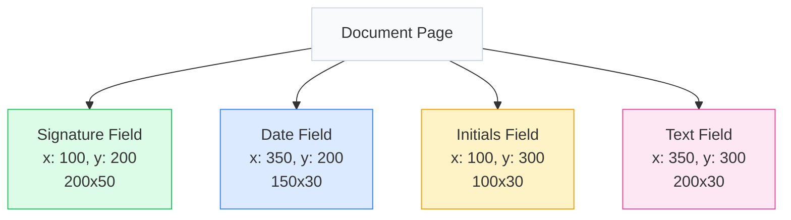

# Signature Field Types

When you want someone to sign a document, you need to tell them where to put their signature or other info. These are called fields. CovoSign has different types like signature, initials, date, and text fields. It's like placing sticky notes on a paper saying 'Sign here' or 'Write your name here'. Each field has a position and size on the page.

CovoSign supports four types of signature fields that can be added to documents.

Fields are interactive elements placed on PDF documents that collect specific types of input from signers. Each field type serves a different purpose in the signing workflow, from capturing legal signatures to collecting additional information. Fields are positioned using coordinates (x, y) and have defined dimensions (width, height), allowing precise placement on document pages.

## Field Placement Example

Fields are positioned using x,y coordinates from the top-left corner of the page, with width and height in points.



- **Signature**: Green
- **Date**: Blue
- **Initials**: Yellow
- **Text**: Pink

## SIGNATURE

Captures a full handwritten signature or electronic signature.

The signature field is the core element of digital signing workflows. It accepts various input methods including mouse drawing, touch signatures on mobile devices, or typed signatures. The field automatically scales the signature to fit while maintaining proportions, ensuring professional appearance regardless of input method.

### Key Behavior
- Content scales proportionally to fit field dimensions
- Maintains aspect ratio
- Centered within the bounding box

```json
{ 
  "type": "SIGNATURE", 
  "recipientId": "550e8400-e29b-41d4-a716-446655440000", 
  "page": 1, 
  "x": 100, 
  "y": 200, 
  "width": 200, 
  "height": 50,
  "name": "Signature_1"
}
```

## INITIAL

Captures recipient's initials.

Initials fields are smaller signature elements often used for document authentication or acknowledgment. They provide a quicker signing option while still capturing the signer's identity. Like signature fields, they support various input methods and are commonly used in multi-page documents where full signatures aren't required on every page.

```json
{ 
  "type": "INITIAL", 
  "recipientId": "550e8400-e29b-41d4-a716-446655440000", 
  "page": 1, 
  "x": 100, 
  "y": 200, 
  "width": 100, 
  "height": 30,
  "name": "Initial_1"
}
```

## DATE

Automatically populated with the date when signed (YYYY-MM-DD).

Date fields automatically record the exact timestamp when a signer completes their action. This provides chronological evidence of when each party signed the document. The date is formatted in ISO 8601 standard (YYYY-MM-DD) and is automatically populated, preventing manual entry errors and ensuring accurate timestamping for legal purposes.

```json
{ 
  "type": "DATE", 
  "recipientId": "550e8400-e29b-41d4-a716-446655440000", 
  "page": 1, 
  "x": 100, 
  "y": 200, 
  "width": 150, 
  "height": 20,
  "name": "Date_1"
}
```

## TEXT

Free-form text input from the recipient.

Text fields allow signers to enter custom information such as names, addresses, or comments. They can be configured with labels to guide users on what information to provide. Unlike signature fields, text fields accept typed input and can be set as required or optional depending on the document's needs.

```json
{ 
  "type": "TEXT", 
  "recipientId": "550e8400-e29b-41d4-a716-446655440000", 
  "page": 1, 
  "x": 100, 
  "y": 200, 
  "width": 200, 
  "height": 50, 
  "name": "FullName",
  "defaultValue": "Enter full name"
}
```
