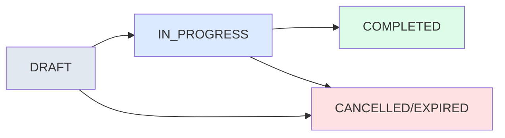

# Signature Statuses

When you send a document for signing, it goes through different stages, like 'draft', 'in progress', 'completed'. Each person signing also has their own status. Knowing these statuses helps you track where things are in the process, like checking if someone has signed yet or if it's done.

The signature request lifecycle involves two parallel state machines: one for the **Request** itself, and one for each individual **Recipient**.

## Request Status Flow

Request moves from draft to in-progress when sent, and completes when all recipients have signed.

## Status Definitions

### Draft
When a signature request is in **Draft** status, it means the document has been created but hasn't been sent out for signatures yet. This is the initial phase where senders can still make changes to the document, add or remove recipients, and configure signing options. For senders, this status allows full editing capabilities— they can modify the document content, adjust field placements, and update recipient information. Recipients don't see draft requests yet, as they haven't been notified. This status ensures that everything is properly set up before the request becomes active.

### In Progress
The **In Progress** status indicates that the signature request has been sent to recipients and is actively being worked on. At least one recipient has received the notification, and the signing process is underway. For senders, this means they can monitor progress, view who has signed, and see which recipients are still pending. They can also cancel the request if needed or create a duplicate for future use. Recipients in this status have different experiences based on their role—if they're the active signer, they can view and sign the document; others can only view it. This status represents the core workflow phase where collaboration happens.

### Done
**Done** status signifies that the signature request has been fully completed, with all required signatures collected and the document finalized. This is the successful end state of the workflow. For senders, it means they can view the completed document, download it, access the audit trail to see the full signing history, and create duplicates for similar future requests. Recipients can also view and download the signed document, and access the audit trail to verify the signing process. This status provides closure and access to the final signed document for all parties involved.

### Canceled
When a signature request is **Canceled**, it means the sender has manually stopped the process before completion. This could happen for various reasons, such as changes in requirements or errors in the original setup. For senders, canceled requests can still be viewed and duplicated if they want to restart the process with modifications. Recipients can only view the canceled request but cannot take any signing actions. This status preserves the request history while preventing further progress, allowing senders to learn from and potentially restart similar workflows.

### Expired
**Expired** status occurs when a signature request reaches its deadline without being completed. This happens automatically when the expiration date set by the sender is reached, and not all required signatures have been collected. For senders, expired requests can be viewed and duplicated to create new requests with extended deadlines or different configurations. Recipients can only view expired requests, as the signing window has closed. This status helps enforce time-sensitive workflows and provides a clear indication that the original request timeline was not met, prompting senders to take follow-up actions if needed.

## Standard Lifecycle

### Creation Phase
**User creates request**
`POST /signature-requests`

The request is initialized. Documents are uploaded. Recipients are created but not yet notified.

- **Request Status**: DRAFT
- **Recipient Status**: PENDING

### Processing Phase
**User sends request**
`POST /send`

Emails sent. Status changes from Draft to In Progress.

- **Request Status**: IN_PROGRESS

### Completion Phase
**All recipients signed**
`System Event`

All parties have signed. Audit trail finalized.

- **Request Status**: COMPLETED

---

## Request Management Rules

Allowed actions based on the current status of the request.

### Sender Actions (Out-Box)

| Status | Allowed Actions |
| :--- | :--- |
| **Draft** | Edit, Duplicate, Delete |
| **In Progress** | View, Cancel, Duplicate |
| **Done** | View, Duplicate, Download, Audit Trail |
| **Canceled** | View, Duplicate |
| **Expired** | View, Duplicate |

### Recipient Actions (In-Box)

| Status | Allowed Actions |
| :--- | :--- |
| **In Progress** | View & Sign (Active), View (Others) |
| **Done** | View, Download, Audit Trail |
| **Canceled** | View Only |
| **Expired** | View Only |

### Action Details

- **Duplicate Request**: Generates a copy of the document with the same recipients and pre-defined fields. Renames to "Duplicate of [Title]" and redirects to Draft status. Completed fields are NOT copied.
- **Send Reminder**: Manually triggers a reminder email. If a signing order exists, only the **Current Active Signer** receives it. Otherwise, all unsigned recipients receive it.
- **Audit Trail**: Only available for "Done" documents. Generates a PDF containing request details and a chronological history of all actions (viewed, signed, etc.) by every party.
