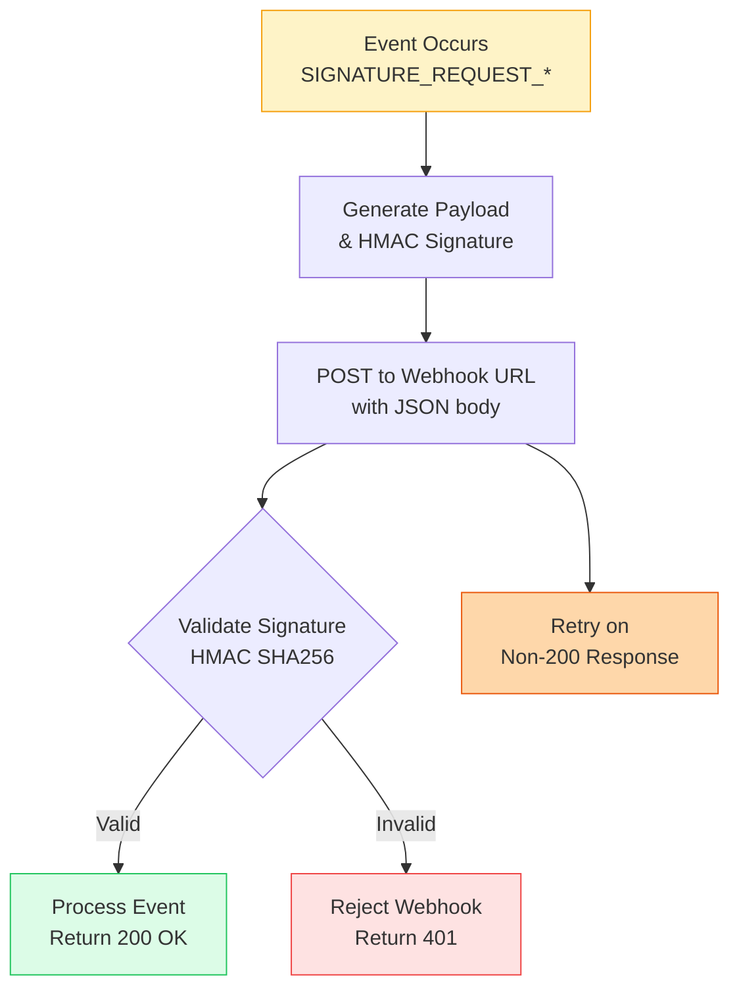

import Tabs from '@theme/Tabs';
import TabItem from '@theme/TabItem';

# Webhooks

Webhooks are like notifications your app gets when something happens, instead of constantly checking. When a document is signed, CovoSign sends a message to your server saying 'Hey, this happened'. It's great for keeping your app updated without wasting time or resources polling the API.

Real-time notifications for signature events so you can update internal systems without polling.

Webhooks are HTTP callbacks that notify your application when specific events occur in CovoSign. Instead of repeatedly checking the API for status updates (polling), your server receives instant notifications, enabling real-time integrations and automated workflows. This push-based approach is more efficient and responsive than pull-based polling.

## Event Types

CovoSign sends different types of webhook events to keep you informed about the signing process. Each event type corresponds to a specific action or state change in the signature workflow. By listening to these events, you can trigger appropriate actions in your application, such as updating databases, sending notifications, or initiating downstream processes.

- `SIGNATURE_REQUEST_COMPLETED`: All parties have signed the document.
- `SIGNATURE_REQUEST_DECLINED`: A recipient refused to sign.
- `RECIPIENT_SIGNED`: One specific recipient completed their part.
- `RECIPIENT_ADDED`: A new signer was added to the request.

Use webhooks to update internal systems, trigger automations, or notify users without polling the API.

## Webhook Flow



- **✓ Valid Webhook**: Signature verified. Process event and return 200 OK.
- **✗ Invalid Signature**: Signature mismatch. Reject webhook and return 401.
- **⏳ Retry Logic**: Non-200 responses trigger exponential backoff retries.

## Security (HMAC)

Webhook security is crucial to prevent malicious actors from sending fake notifications to your endpoints. CovoSign uses HMAC (Hash-based Message Authentication Code) signatures to verify that webhook payloads are authentic and haven't been tampered with. You should always validate the signature on your server before processing the webhook data.

> **Important**: Never expose your Webhook Secret in client-side code. Verification must happen on your secure backend server.

### HMAC Verification

<Tabs>
  <TabItem value="javascript" label="Node.js" default>
    ```javascript
    const crypto = require('crypto');

    const expected = crypto.createHmac('sha256', secret).update(payload).digest('hex');
    const isValid = expected === receivedSignature;
    ```
  </TabItem>
  <TabItem value="python" label="Python">
    ```python
    import hmac
    import hashlib

    expected = hmac.new(secret.encode(), payload, hashlib.sha256).hexdigest()
    is_valid = expected == received_signature
    ```
  </TabItem>
  <TabItem value="java" label="Java">
    ```java
    import javax.crypto.Mac;
    import javax.crypto.spec.SecretKeySpec;
    import java.nio.charset.StandardCharsets;

    Mac mac = Mac.getInstance("HmacSHA256");
    SecretKeySpec secretKey = new SecretKeySpec(secret.getBytes(StandardCharsets.UTF_8), "HmacSHA256");
    mac.init(secretKey);
    byte[] hash = mac.doFinal(payload.getBytes(StandardCharsets.UTF_8));
    String expected = bytesToHex(hash);
    boolean isValid = expected.equals(receivedSignature);
    ```
  </TabItem>
  <TabItem value="bash" label="Bash">
    ```bash
    # Using openssl for HMAC verification
    expected=$(echo -n "$payload" | openssl dgst -sha256 -hmac "$secret" -hex | cut -d' ' -f2)
    if [ "$expected" = "$received_signature" ]; then
        echo "Valid signature"
    else
        echo "Invalid signature"
    fi
    ```
  </TabItem>
</Tabs>

### Delivery & retries
- Expect exponential backoff retries on non-200 responses.
- Log and validate `X-CovoSign-Signature` headers.
- Respond quickly (under a few seconds) to avoid timeouts.
