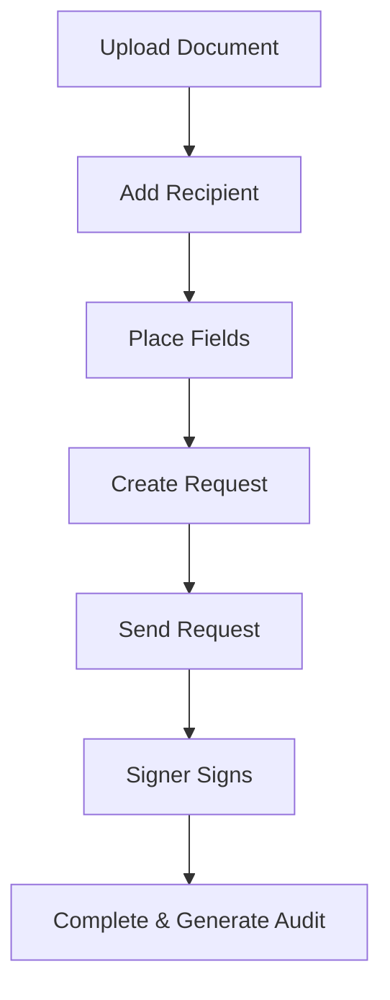
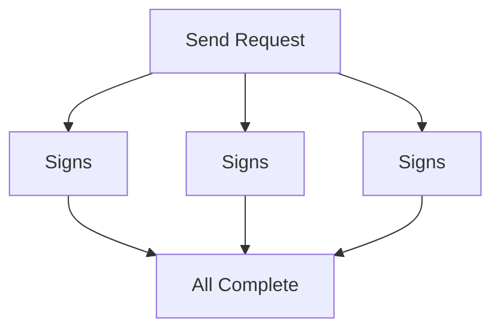
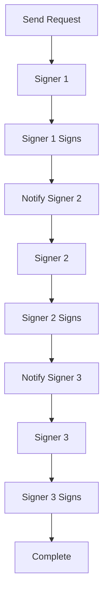

# Signer Workflow Types

Workflows are the steps people follow to sign a document. Some documents need one person to sign, others need multiple people in order or at the same time. CovoSign lets you set up these workflows so the signing happens in the right sequence, like a team approving a contract step by step.

CovoSign supports flexible signer workflows, including single-signer, parallel multi-signer, and sequential approval chains.

## Single Signer Workflow

The simplest workflow sending a document to one recipient for signature.

### Process Flow
Upload Document → Add Recipient → Place Fields → Create Request → Send → Sign → Complete



```json
{
  "title": "Simple Agreement",
  "recipients": [
    {
      "email": "signer@example.com",
      "name": "John Doe",
      "role": "SIGNER",
      "order": 1
    }
  ]
}
```

## Multi-Signer Workflows

Handle multiple recipients either simultaneously (Parallel) or in a specific order (Sequential) with automatic notifications and deadlines.

### Parallel (Broadcast)

All recipients are notified simultaneously and can sign in any order.

#### Parallel Flow Diagram
Send Request → All signers notified simultaneously → Any order signing → All Complete



#### Configuration Key
Set the same `order` (e.g., 1) for all recipients.
- Bulk notification sending
- Faster completion time

```json
"recipients": [
  { "email": "party1@example.com", "name": "Party 1", "order": 1 },
  { "email": "party2@example.com", "name": "Party 2", "order": 1 },
  { "email": "party3@example.com", "name": "Party 3", "order": 1 }
]
```

### Sequential (Ordered)

Recipients are notified and must sign in a strict specific order (e.g., Employee &rarr; Manager &rarr; HR).

#### Sequential Flow Diagram
Send Request → Signer 1 signs → Notify Signer 2 → Signer 2 signs → Notify Signer 3 → Signer 3 signs → Complete



#### Configuration Key
Increment `order` (1, 2, 3...) for each step.
- Controlled approval chain
- Later signers see previous signatures

```json
"recipients": [
  { "email": "manager@example.com", "name": "Manager", "order": 1 },
  { "email": "director@example.com", "name": "Director", "order": 2 },
  { "email": "ceo@example.com", "name": "CEO", "order": 3 }
]
```

## Workflow Comparison

| Feature | Parallel | Sequential |
| :--- | :--- | :--- |
| **Signing Order** | Same (e.g., all 1) | Incremental (1, 2, 3...) |
| **Notification** | Immediate for all | Only when previous step complete |
| **Completion** | When all sign | When final signer signs |
